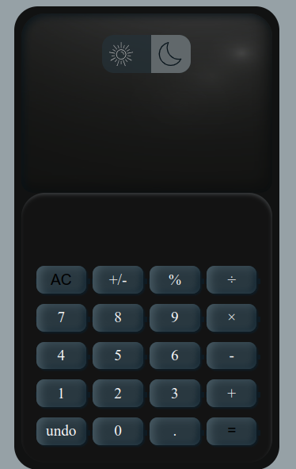
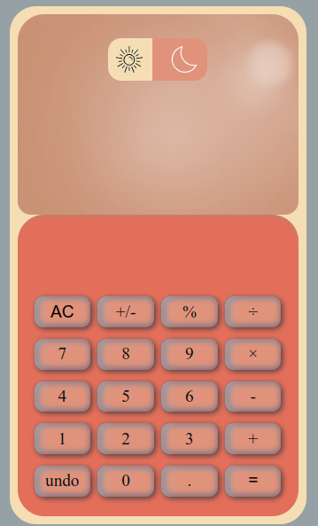

# :hammer_and_wrench: dark-light-calculator :hammer_and_wrench: 

:: :: ::

## :shield: Chalenge de JavaScript puro - Crear una Calculadora con un switch modo claro/oscuro.

:gear:  Esta es una solución del desafío del curso NUCBA para armar una calculadora. Ver link https://plataforma.nucba.io/c/javascript-e51d58/todo-list-calculadora-ondemand  :gear:

:gear:  En este desafío, se armó el index.html y style.css con el conocimiento adquirido en el curso Diseño Web de NUCBA, utilizandose de label y inputs type radio ocultos, con sus valores predeterminados para cada button.  :gear:

## :shield: Desafíos y dificuldades:

:gear:  Las dificultades encontradas fueron en armar funciones distintas para cada clase de butones, numeros, operaciones, percentage y undo. Fue un desafío armar las condiciones para las distintas situaciones. Un desafío a parte armar una condición para evitar que un operador no se duplique. Y especialmente distintos comportamientos si el primer boton despues de un resultado es un numero o un operador matemático.  :gear:

## :chains: Link: [https://rodri-dark-light-calculator.vercel.app/](https://rodri-dark-light-calculator.vercel.app/)
